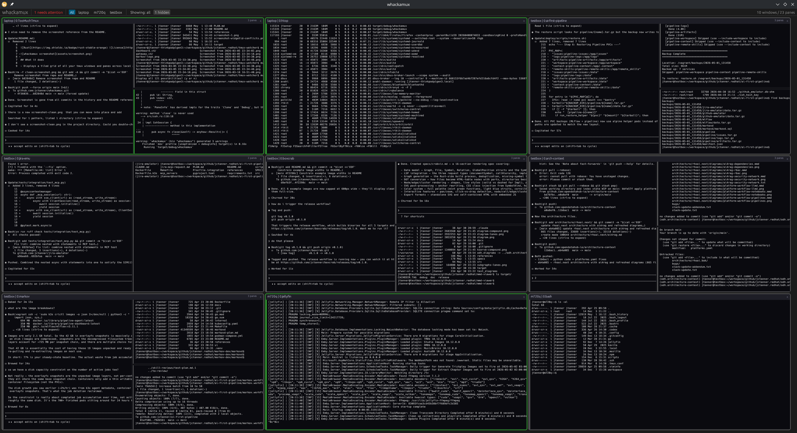

# whackamux

Whack-a-mole for tmux. A desktop dashboard for monitoring and interacting with tmux sessions across multiple machines. Panes that need attention light up red — whack them with a quick response and move on.

 



## What it does

- Displays a tiled grid of all your tmux windows and panes across local and remote hosts
- Highlights panes that need attention (configurable pattern matching on pane content)
- Quick-action buttons to send common responses (yes, y, enter) to waiting panes
- Click any pane to focus it and type directly into it
- Full tmux prefix key support (Ctrl+B then command key)
- SSH connections to remote machines using pure Rust (no system ssh binary required)
- Works on Linux, macOS, and Windows

## Building

```
cargo build --release
```

## Configuration

Create a `config.yaml` in the working directory:

```yaml
hosts:
  - name: laptop
    local: true
  - name: server1
    ssh: user@192.168.1.100
    # port: 22
    # key: /path/to/private/key

poll_interval_secs: 2

attention_patterns:
  - "Do you want to"
  - "Allow"
  - "yes/no"
  - "Permission"
  - "Press enter"

quick_actions:
  - label: "yes"
    keys: "yes\n"
  - label: "y"
    keys: "y\n"
  - label: "enter"
    keys: "\n"
```

### Hosts

- `local: true` — monitors tmux on the local machine
- `ssh: user@host` — connects over SSH with key-based auth
- `port` — SSH port (default: 22)
- `key` — explicit path to SSH private key (default: tries `~/.ssh/id_ed25519`, `id_rsa`, `id_ecdsa`)

### Attention patterns

Strings matched against the last 15 lines of each pane. When a match is found, the pane border turns red and quick-action buttons appear.

## Usage

```
whackamux
```

Or with debug logging:

```
RUST_LOG=debug whackamux
```

### Controls

- **Click** a pane to focus it for keyboard input (click again to unfocus)
- **Type** to send keystrokes to the focused pane
- **Ctrl+B** then a key to send tmux commands (c=new window, n=next, p=prev, etc.)
- **X button** on a window tile header to hide it from the grid
- **Host tabs** in the toolbar to filter by machine
- **Quick-action buttons** appear on panes that need attention

## License

MIT
